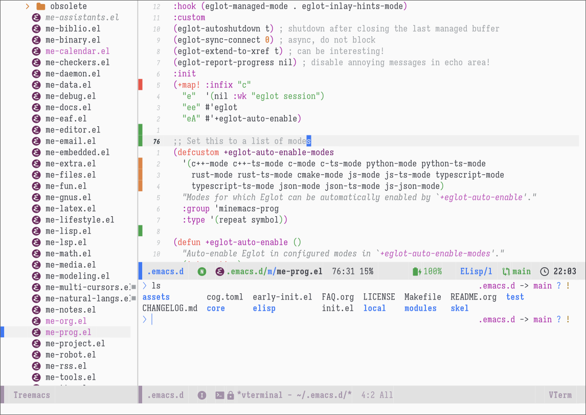

# MinEmacs

[](https://github.com/abougouffa/minemacs/actions/workflows/ci-linux.yaml)
[](https://github.com/abougouffa/minemacs/actions/workflows/ci-macos.yaml)
[](https://github.com/abougouffa/minemacs/actions/workflows/ci-windows.yaml)

**MinEmacs** is a lightweight Emacs configuration framework.




## Why?
I was using Doom Emacs, which I initially considered to be a remarkable software
that introduced me to the world of Emacs. Nonetheless, my experience with it
turned out to be **less enjoyable** later.

Emacs forms the foundation of my workflow, serving as my go-to tool for various
tasks such as document writing, academic paper writing, programming in multiple
languages, email management, and staying updated with news, among other things.

Hence, I wanted a framework that is both robust and straightforward. Doom Emacs
seemed like a suitable choice initially. However, before I started this project
back in September 2022, I encountered numerous issues with Doom Emacs.
Occasionally, after running the `doom upgrade` command, everything would cease to
function properly. These problems always seemed to arise during my busiest days,
causing unnecessary additional stress. To be frank, at that time, Doom Emacs
started to feel overly complex as a configuration framework. It incorporated a
command line interface, an extensive library with extra features, numerous
unnecessary hacks to tweak Emacs behavior for a negligible improvement in
startup time, configuration modules that tightly combined various packages in an
opinionated manner, CI commands, and even a profile manager! Each of these
features introduced extra complexity and more failure points at every layer.

As a result, MinEmacs emerged as my personal configuration framework for Emacs,
*and it continues to serve that purpose*. I'm trying to tailor it to my specific
needs while maintaining its modularity and portability, you can refer to the
[change log](CHANGELOG.md) for more information about the evolution of MinEmacs. However, I have
no intention or availability to create an alternative to Doom Emacs or
Spacemacs. While I find joy (like every other Emacser out there) in tinkering
with Emacs, MinEmacs remains just a tool that I use in my everyday work, and
that I like to share with other Emacsers. However, please note that I am not
really interested in becoming a full-time maintainer of this tool that I would
only use to maintain itself!

## Install
Open a shell and run:

```shell
git clone https://github.com/abougouffa/minemacs.git ~/.emacs.d && emacs
```

By executing this command, the repository will be cloned, and Emacs will be
launched. During the initial run, Emacs will automatically install the necessary
packages.

> [!IMPORTANT]
> Please note that I'm using a fresh Emacs 29 built from source on a Manjaro
> Linux system. I have enabled basic [Github CI actions](https://github.com/abougouffa/minemacs/actions) to automatically test
> running Emacs 28, 29 and a fresh 30 build on [Ubuntu Linux](https://github.com/abougouffa/minemacs/actions/workflows/ci-linux.yaml) and [MacOS](https://github.com/abougouffa/minemacs/actions/workflows/ci-macos.yaml) and Emacs
> 28 on [Windows](https://github.com/abougouffa/minemacs/actions/workflows/ci-windows.yaml). These actions ensure that MinEmacs is "runnable"; with all
> modules enabled on these systems. However, more testing should be done to
> validate the configuration on systems other than Linux.
>
> I'm trying to support at least Emacs 28.2, so [I back port some of the new
> functions/macros I use to Emacs 28](core/backports/). Furthermore, for Emacs 28 and earlier,
> MinEmacs includes the `me-compat` module which loads the `compat` package at early
> stage (just after bootstrapping `straight` and `use-package`), this can facilitate
> porting MinEmacs to earlier Emacs versions. However, I've never tested
> MinEmacs with versions earlier than 28.2, and I don't plan to do so!

## Customization
To personalize MinEmacs, you can incorporate a specific set of files within the
default user configuration directory, which is located at `~/.minemacs.d`.
However, if you prefer to use a different directory, you have the flexibility to
do so by setting the `MINEMACSDIR` environment variable.

### Main configuration files
There are two main files that can be added in the `~/.minemacs.d` directory:

1. The `~/.minemacs.d/modules.el` file contains a list of enabled modules and a
   list of disabled packages (`minemacs-core-modules`, `minemacs-modules` and
   `minemacs-disabled-packages` can be set in this file).
2. The `~/.minemacs.d/config.el` file contains the user configuration and
   customization, you can think of it as your `init.el`, which gets loaded at the
   end of MinEmacs' `init.el`!

This repository contains skeleton files for [`modules.el`](skel/modules.el) and [`config.el`](skel/config.el) (under
[`skel/`](skel)). We highly recommend following the same structure as in the skeleton
files, specially the use of `with-eval-after-load` and `use-package` instead of
using `require` directly (`require` loads the packages immediately, which increases
the startup time of Emacs).

### Advanced configuration files
MinEmacs provides also some advanced customization files, these files can be
used to tweak MinEmacs' behavior, add some early initialization code, make
MinEmacs runnable on older Emacs versions, etc.

1. The `~/.minemacs.d/early-config.el` file is loaded at the end of MinEmacs'
   `early-init.el`. You can use it to set up some early stuff like tweaking the
   UI, overwrite the variables set by MinEmacs, and so on.
2. The `~/.minemacs.d/init-tweaks.el` file is loaded at an early stage of the
   `init.el` file. You can use it to do some useful stuff before MinEmacs starts
   to customize packages and load modules. This can be useful for porting
   MinEmacs to an older Emacs version by providing an implementation of new
   functions MinEmacs uses. See the [`init.el`](init.el) for more information.

### Environment variables
You can customize MinEmacs' behavior via some environment variables.

- `MINEMACS_DIR` or `MINEMACSDIR`: Path for MinEmacs user configuration directory,
  if not set, `~/.minemacs.d/` is used.
- `MINEMACS_MSG_LEVEL`: Change message log level, from 1 (only errors) to 4 (all
  messages).
- `MINEMACS_VERBOSE`: Be more verbose (useful for debugging).
- `MINEMACS_DEBUG`: Enable debugging at startup.
- `MINEMACS_ALPHA`: Set frame `background-alpha` to percentage (value from 0 to
  100).
- `MINEMACS_NOT_LAZY`: Load lazy packages immediately after loading Emacs.
- `MINEMACS_ALWAYS_DEMAND`: Load all packages immediately (this works by setting
  `use-package-always-demand` to `t` and `use-package-always-defer` to `nil`.
- `MINEMACS_IGNORE_VERSION_CHECK`: Do not perform version check in `init.el`, this
  can be useful if you use `~/.minemacs.d/init-tweaks.el` to implement the
  functionalities used by MinEmacs and missing from your Emacs version.
- `MINEMACS_IGNORE_USER_CONFIG`: space-separated values, used to disables loading
  `~/.minemacs.d/<file>.el` user configuration files. Accepted values for `<file>`
  are: `early-config`, `init-tweaks`, `modules`, `config`, `local/early-config`,
  `local/init-tweaks`, `local/modules` and `local/config`. Use `all` to disable all
  user configuration files.

### Load and hooks order
MinEmacs loads its features and run hooks in this order:

- `~/.emacs.d/early-init.el`
- `$MINEMACSDIR/early-config.el` *(unless disabled in `$MINEMACS_IGNORE_USER_CONFIG`)*
- `$MINEMACSDIR/local/early-config.el` _(unless disabled)_
- `~/.emacs.d/init.el`
  - `before-init-hook`
  - `~/.emacs.d/core/me-vars.el`
  - `~/.emacs.d/core/backports/*.el` _(when Emacs < 29)_
  - `~/.emacs.d/core/me-loaddefs.el`
  - `$MINEMACSDIR/init-tweaks.el` _(unless disabled)_
  - `$MINEMACSDIR/local/init-tweaks.el` _(unless disabled)_
  - `$MINEMACSDIR/modules.el` _(unless disabled)_
  - `$MINEMACSDIR/local/modules.el` _(unless disabled)_
  - `~/.emacs.d/core/<module>.el` _(for module in `minemacs-core-modules`)_
  - `~/.emacs.d/modules/<module>.el` _(for module in `minemacs-modules`)_
  - `minemacs-after-loading-modules-hook`
  - `$MINEMACSDIR/custom-vars.el`
  - `$MINEMACSDIR/config.el` _(unless disabled)_
  - `$MINEMACSDIR/local/config.el` _(unless disabled)_
  - `after-init-hook`
  - `emacs-startup-hook`
  - `minemacs-after-startup-hook`
    - `minemacs-lazy-hook` _(delayed)_

Special hooks defined with `+make-first-file-hook!`:

- `minemacs-first-file-hook`
- `minemacs-first-elisp-file-hook`
- `minemacs-first-org-file-hook`

## Troubleshooting
If you experienced an issue with MinEmacs, you can check the [FAQ](FAQ.md), check [open
issues or open a new one](https://github.com/abougouffa/minemacs/issues).
